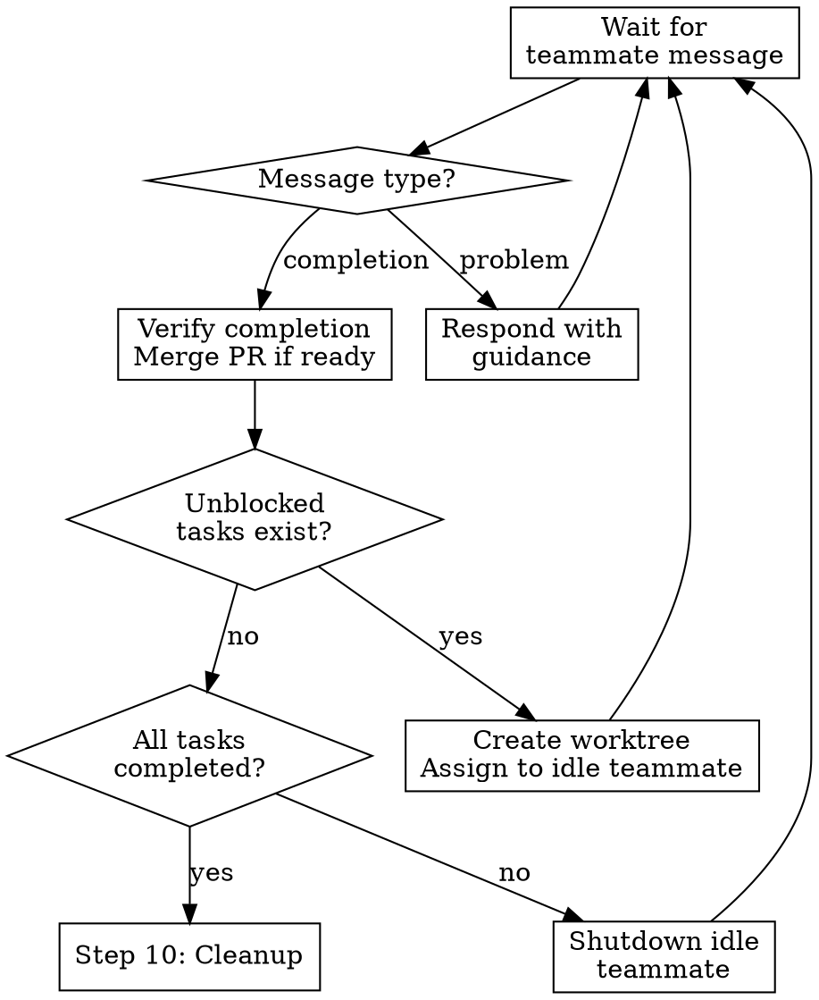

# Resolve Linear Project

Orchestrate resolving ALL issues in a Linear project using Agent Teams.
Each issue is resolved by a dedicated `issue-resolver` teammate working
in its own git worktree. Issue dependencies are respected via the shared
task list's blocking mechanism.

Start by creating a TODO list to complete all steps outlined below.

## Prerequisites

- Agent Teams enabled (`CLAUDE_CODE_EXPERIMENTAL_AGENT_TEAMS=1` in settings)
- Git worktrees support (standard git)
- Linear MCP configured

## Steps

### 1. Fetch Project and Issues

Use `mcp__linear__get_project` to fetch the project.
Then use `mcp__linear__list_issues` filtered to the project
to get ALL issues.

Collect for each issue:
- ID, title, identifier (e.g., `ENG-123`)
- Status (skip Done/Canceled issues)
- `blockedBy` array (issue IDs this depends on)
- Priority

### 2. Build Dependency Graph and Wave Plan

Analyze `blockedBy` relationships. See `dependency-graph.md` for the
full algorithm.

Classify issues into execution waves:
- **Wave 0**: Issues with no unresolved blockers (start immediately)
- **Wave 1**: Issues whose blockers are all in Wave 0
- **Wave N**: Issues whose blockers are all in prior waves

If a cycle is detected, STOP and report to the user.

### 3. Determine Parallelism

```
max_teammates = min(count(wave_0_issues), 3)
```

Cap at 3 concurrent teammates. Linear projects are 5-7 issues max;
more than 3 teammates creates diminishing returns from overhead and
merge conflict risk.

### 4. Set Up Git Worktrees

**REQUIRED:** Use the `using-git-worktrees` skill conventions for
directory selection and safety verification.

Create a worktree ONLY for Wave 0 issues initially:

```
git worktree add .worktrees/<issue-identifier> -b <issue-identifier>-<slug>
```

Example: `.worktrees/eng-123` with branch `eng-123-configure-oauth`

Run project setup in each worktree (auto-detect: npm install, etc.).

After project setup, copy environment files from the main working
directory to each worktree. Environment files (`.env`, `.env.local`,
`.env.test`, etc.) are typically gitignored and will NOT exist in
new worktrees:

```bash
# Copy all .env* files from main working directory to worktree
# Adjust source path based on project structure (root, frontend/, etc.)
cp <main-dir>/.env* <worktree-path>/  2>/dev/null || true
```

If the project has nested env files (e.g. `frontend/.env.local`),
copy those to the corresponding subdirectory in the worktree.

### 5. Create Agent Team

Use Teammate tool:

```
operation: "spawnTeam"
team_name: "project-<project-identifier>"
description: "Resolving all issues in Linear project: <project name>"
```

### 6. Create Tasks in Shared Task List

For EACH open issue, use TaskCreate:
- subject: "Resolve \<issue-identifier\>: \<issue-title\>"
- description: Include issue ID, identifier, worktree path (for Wave 0 issues),
  and: "You MUST invoke the resolve-linear-issue skill using the Skill
  tool before starting any implementation work."
  Do NOT include inline step-by-step instructions in the task description.
  The skill contains the complete workflow including post-PR review steps
  that are critical and easy to accidentally omit when paraphrasing.
- activeForm: "Resolving \<issue-identifier\>"

Then establish dependencies via TaskUpdate:
- For each task whose Linear issue has `blockedBy`, add `addBlockedBy`
  pointing to the task IDs of those blocker issues.

This maps Linear dependency chains directly onto the shared task list.

### 7. Spawn Issue-Resolver Teammates for Wave 0

For each Wave 0 issue (up to `max_teammates`), spawn a teammate
using the Task tool:

- team_name: the team name from Step 5
- name: "\<issue-identifier\>-resolver" (e.g., "eng-101-resolver")
- subagent_type: "general-purpose"
- prompt: Instruct the teammate to:
  1. Check the shared task list for their assigned task
  2. Read the task to get issue ID and worktree path
  3. Change to the worktree directory
  4. Invoke the `resolve-linear-issue` skill using the Skill tool
     (do NOT paraphrase or abbreviate the workflow)
  5. After the skill completes, message the team lead

  CRITICAL: Do NOT include inline step-by-step implementation
  instructions in the prompt. The resolve-linear-issue skill contains
  the complete workflow including PR check monitoring, pr-reviewer
  iteration, and Linear issue updates. Inlining abbreviated steps
  causes agents to skip these critical post-PR stages.

  Include the team name and any worktree-specific context (path,
  branch name, environment setup notes).

The issue identifier in the name gives immediate observability into
which issue each teammate is working on.

### 8. Assign Wave 0 Tasks

Use TaskUpdate to assign each task to its corresponding teammate:
- Task for ENG-101 → owner: "eng-101-resolver"
- Task for ENG-102 → owner: "eng-102-resolver"
- If more Wave 0 tasks than `max_teammates`, leave extras unassigned.
  When a teammate completes its task, spawn a new teammate named
  after the next issue (e.g., "eng-104-resolver") and assign it.

### 9. Monitor and Coordinate

Enter a monitoring loop. Use delegate mode (Shift+Tab) to stay
focused on coordination.

a. **On task completion message from teammate:**
   - Verify task is marked completed in TaskList
   - **Verify genuine completion** before proceeding. The teammate's
     message must confirm ALL of the following:
     - PR checks have passed (or been fixed)
     - pr-reviewer agent was called and the PR was approved
     - Linear issue was updated with findings
     If the teammate only reports "PR created/opened" without these
     confirmations, send a message asking them to complete the
     remaining resolve-linear-issue workflow steps (PR check
     monitoring, pr-reviewer review cycle, Linear update) before
     marking the task done. Do NOT send shutdown_request until
     these are confirmed.
   - Coordinate PR merge order: foundational PRs first
   - After merging a PR, notify active teammates to rebase
   - Create worktrees for newly-unblocked Wave N issues
   - For each newly-unblocked issue, spawn a new teammate named
     "\<issue-identifier\>-resolver" (e.g., "eng-103-resolver") and
     assign the corresponding task to it
   - Send shutdown_request to the completed teammate (its issue
     identifier is already in its name, so it's clear which is done)

b. **On problem report from teammate:**
   - Merge conflicts: Provide resolution guidance (blocker's
     changes are canonical)
   - Failing PR checks: Let teammate handle (resolve-linear-issue
     has check-fix loops)
   - Architectural questions spanning issues: Provide guidance

c. **Stale detection:**
   - If no messages from a teammate for extended period,
     send a status check message

#### Monitoring loop flowchart



### 10. Cleanup

Once ALL tasks are completed:

a. Send shutdown_request to all remaining teammates
b. Wait for all shutdown confirmations
c. Use Teammate tool with `operation: "cleanup"`
d. Remove git worktrees:
   `git worktree remove .worktrees/<identifier>` for each
e. Update the Linear project with a summary of all resolved issues

## Merge Conflict Handling

When a teammate reports a merge conflict:
1. Identify conflicting files
2. Blocker's changes are canonical (they were merged first)
3. Send resolution guidance to affected teammate
4. If complex, have teammate pause for team lead guidance

## Red Flags

**Never:**
- Spawn more than 3 concurrent teammates
- Let teammates work in the same worktree
- Skip dependency analysis (issues may have blockers)
- Merge Wave N+1 PRs before Wave N PRs
- Leave worktrees uncleaned after completion

**Always:**
- Create worktrees lazily (per wave, not all at once)
- Merge PRs in dependency order
- Notify teammates to rebase after a merge
- Verify PR approval before merging
